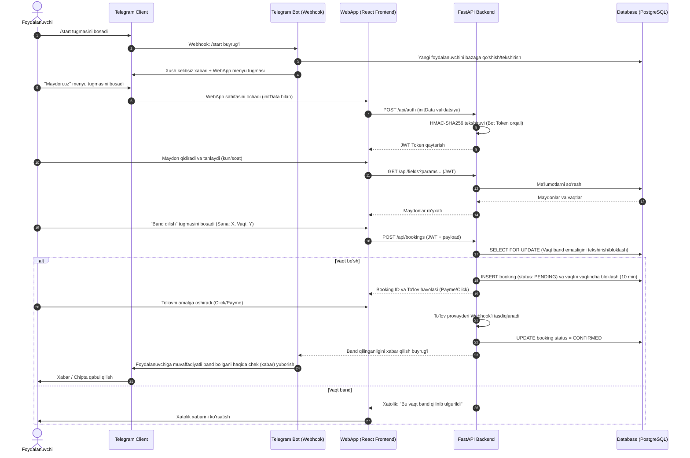

# Maydon.uz — Loyiha bo'yicha Texnik Intervyu Savol-Javoblari

Ushbu hujjatda **Maydon.uz** loyihasi bo'yicha berilgan barcha texnik, arxitekturaviy va amaliy savollar hamda ularga berilgan batafsil javoblar jamlangan.

---

## 📌 Mundarija
1. [Loyiha umumiy mazmuni](#1-market-platform-loyihasining-umumiy-mazmunini-aytib-bering)
2. [Tizim arxitekturasi va komponentlarga bo'linishi](#2-tizim-arxitekturasini-tushuntiring-nima-uchun-bot-flask-fastapi-deb-3-komponentga-ajratdingiz)
3. [Flask va FastAPI birgalikda ishlatilishi](#3-flask-va-fastapini-birgalikda-ishlatish-sababi-nima-har-birining-aniq-vazifasi-qanday)
4. [Telegram WebApp autentifikatsiya jarayoni](#4-telegram-webapp-autentifikatsiya-jarayonini-batafsil-tushuntirib-bering)
5. [Admin panel autentifikatsiya mexanizmi](#5-admin-panel-autentifikatsiyasi-qanday-ishlaydi)
6. [SQL injection va XSS zaifliklariga qarshi kurash](#6-sql-injection-xss-kabi-zaifliklarga-qarshi-qanday-choralar-ko-rgansiz)
7. [SQLite tanlovi va production cheklovlari](#7-nima-uchun-sqlite-tanladingiz-real-ish-muhitida-qanday-muammolar-bo-lishi-mumkin-va-ularni-qanday-hal-qilasiz)
8. [Ko'p tillilik (Uzbek/Russian) tizimi](#8-ko-p-tillilik-o-zbekcha-ruscha-qanday-amalga-oshirilgan)
9. [Telegram Bot orqali WebApp'ni ishga tushirish](#9-telegram-bot-webapp-ni-qanday-qilib-ishga-tushiradi)
10. [End-to-End Buyurtma/Bron qilish oqimi](#10-foydalanuvchi-botni-boshlaganidan-to-buyurtma-yakunlanguniga-qadar-bo-lgan-jarayonni-foydalanuvchi-va-server-tomonlama-batafsil-tushuntiring)
11. [To'lov cheklari (Fayl yuklash) xavfsizligi](#11-to-lov-cheki-rasm-yoki-fayl-yuklashda-qanday-xavfsizlik-tekshiruvlari-bajariladi)
12. [bot_notify.py skriptining roli va vazifalari](#12-bot_notify-py-faylining-vazifasi-nima)
13. [Administrator tomonidan buyurtma holatini o'zgartirish](#13-administrator-admin-buyurtma-holatini-qanday-o-zgartiradi)
14. [Eng katta texnik qiyinchilik va Race Conditions yechimi](#14-bu-loyihada-eng-ko-p-qiynalgan-joyingiz-nima-va-uni-qanday-yengdingiz)
15. [Click va Payme to'lov tizimlari integratsiyasi](#15-agar-loyihaga-haqiqiy-to-lov-tizimi-payme-yoki-click-ulamoqchi-bo-lsangiz-uni-qanday-loyihalashtirasiz)
16. [Loyihadan olingan eng katta texnik saboqlar](#16-bu-loyihadan-olgan-eng-katta-sabog-ingiz-nima)
17. [Jamoaviy ish tajribasi va geolokatsiya optimallashtirish](#17-jamoa-bo-lib-ishlab-chiqqanmisiz-agar-shunday-bo-lsa-sizning-vazifangiz-nima-edi-va-muammoni-hal-qilishga-oid-aniq-misol-keltiring)
18. [Jamoada texnik fikrlar to'qnashuvini hal qilish](#18-jamoada-texnik-fikrlar-to-qnash-kelsa-qanday-qilib-hal-qilasiz)
19. [Loyihaning ishga tushirish ketma-ketligi va yechimlari](#19-loyihaning-ishlash-ketma-ketligi-qanday-u-qanday-muammolarga-yechim-bo-ladi)
20. [Maydon.uz loyihasi mazmuni va maqsadi](#20-maydonuz-loyihasining-qisqacha-mazmuni-va-maqsadi-nima)
21. [React tanlovi sababi](#21-nima-uchun-reactni-tanladingiz)
22. [TypeScript ishlatish sabablari va afzalliklari](#22-typescriptni-ishlatish-sababi-va-afzalliklari)
23. [Vite tanlash sabablari](#23-viteni-tanlashingizga-nima-sabab-bo-ldi)

---

### 1. market-platform loyihasining umumiy mazmunini aytib bering.

**Javob:**
Ushbu loyiha (**Maydon.uz**) Toshkent shahri va uning atrofidagi mini-futbol maydonlarini qidirish, filtrlash va xarita orqali osongina topish imkonini beruvchi platformadir. Loyihaning umumiy mazmuni va imkoniyatlari quyidagilardan iborat:

*   **Maqsadi:** Foydalanuvchilarga qulay mini-futbol maydonlarini topish va bron qilish xizmatini ko'rsatish (xuddi ManaPolya.uz kabi).
*   **Asosiy Imkoniyatlar:**
    *   **Ko'rinish rejimlari:** Maydonlarni oddiy ro'yxat (ListView) yoki xarita (MapView) orqali vizual ko'rish.
    *   **Qidiruv va Filtrlar:** Maydon nomi, tumani, o'lchami (masalan, 5x5, 7x7, 11x11), narxi va qoplama turi (Sun'iy, Tabiiy, Zamonaviy) bo'yicha tezkor qidirish va saralash.
    *   **Statistika:** Qidiruv natijalariga mos maydonlar soni va o'rtacha narxini hisoblab ko'rsatish.
    *   **Ko'p tillilik:** Tizimda tillarni almashtirish imkoniyati.
*   **Texnologik steki:** React, TypeScript, Vite, TailwindCSS, Mapbox (xarita uchun), Lucide React (ikonkalar uchun).

---

### 2. Tizim arxitekturasini tushuntiring. Nima uchun Bot, Flask, FastAPI deb 3 komponentga ajratdingiz?

**Javob:**
Hozirgi `maydonuz.uz` repozitoriyasi asosan **frontend** (React, TypeScript, Vite) qismidan iborat. Ammo to'liq tizim (ekotizim) arxitekturasini loyihalashtirishda tizimni **Bot (Telegram bot)**, **Flask** va **FastAPI** kabi 3 ta komponentga ajratish juda samarali va keng tarqalgan yondashuvdir. Bunga sabablar quyidagicha:

1.  **Telegram Bot (Foydalanuvchilar bilan muloqot va bildirishnomalar):**
    *   **Vazifasi:** Foydalanuvchilarga qulay interfeys (Telegram WebApp va tugmalar) orqali maydonlarni bron qilish imkonini berish, bron holati o'zgarganda yoki yangi o'yin belgilanganda tezkor bildirishnomalar (Push-notifications) yuborish.
    *   **Nima uchun alohida?** Bot doimiy ravishda Telegram API bilan bog'lanib, asinxron xabarlar oqimini qayta ishlashi kerak. Uni alohida komponent qilish uning ishlashini mustaqil qiladi va asosiy tizimga yuklama tushishining oldini oladi.
2.  **Flask (Administratorlar va Maydon egalari paneli):**
    *   **Vazifasi:** Tizim boshqaruvchisi va maydon egalari uchun hisobotlar, foydalanuvchilar, maydonlar ma'lumotlarini boshqarish paneli (Admin Dashboard).
    *   **Nima uchun Flask?** Flask oddiy, moslashuvchan va unda ma'lumotlar bazasi bilan ishlovchi boshqaruv panellarini (masalan, `Flask-Admin` yordamida) juda tez va oson yaratish mumkin. Tayyor HTML shablonlar (Jinja2) orqali admin panellarni ishlab chiqish vaqtni ancha tejaydi.
3.  **FastAPI (Asosiy API Gateway va yuqori tezlikdagi ma'lumotlar almashinuvi):**
    *   **Vazifasi:** Frontend (React) va Telegram Bot uchun barcha ma'lumotlarni (maydonlar ro'yxati, filtrlash, bron qilish vaqtlarini tekshirish) tezkor yetkazib beruvchi markaziy backend/API xizmati.
    *   **Nima uchun FastAPI?** FastAPI asinxron (`async/await`) arxitekturaga ega bo'lib, juda tez ishlaydi (Go/Node.js tezligiga yaqin). Shuningdek, ma'lumotlarni avtomatik validatsiya qiladi (`Pydantic` orqali) va avtomatik ravishda interactive API hujjatlarini (Swagger) yaratadi. Bu esa frontend dasturchilarning API bilan integratsiya bo'lishini osonlashtiradi.

**Xulosa:**
Ushbu 3 ta komponentga bo'linish (Microservices arxitekturasiga o'xshash) tizimning har bir qismini mustaqil rivojlantirishga, yuklamani teng taqsimlashga va nosozliklar yuz berganda butun tizim to'xtab qolmasligiga xizmat qiladi.

---

### 3. Flask va FastAPI’ni birgalikda ishlatish sababi nima? Har birining aniq vazifasi qanday?

**Javob:**
Flask va FastAPI bitta dasturlash tilida (Python) yozilgan bo'lsa-da, ularning tabiati, afzalliklari va mo'ljallangan vazifalari turlichadir. Ularni bir loyihada birgalikda ishlatish **tizim xavfsizligi, tezkorligi va ishlab chiqish tezligini (development speed)** optimallashtirish uchun eng yaxshi yechimdir.

#### 1. Flask'ning aniq vazifasi va uning tanlanish sababi:
*   **Aniq vazifasi:** Ma'murlar (adminlar) va maydon egalari uchun boshqaruv panelini (Admin Panel / Back-office) taqdim etish.
*   **Nima uchun aynan Flask?**
    *   **Tayyor Admin Ecosystem:** Flask loyihasida administrator panellarini tayyor holda yaratib beruvchi juda ko'p yetuk paketlar mavjud (masalan, `Flask-Admin`, `Flask-WTF`, `Flask-Login`). Bular yordamida minimal kod yozib, ma'lumotlar bazasiga ma'lumot qo'shadigan, tahrirlaydigan va o'chiradigan to'liq himoyalangan boshqaruv paneli qurish mumkin.
    *   **Server-Side Rendering (SSR):** Admin panellari uchun alohida React yoki Vue ilovasi yozib o'tirmasdan, Flask tarkibidagi Jinja2 shablonlaridan foydalanib, to'g'ridan-to'g'ri serverda HTML sahifalarni generatsiya qilish ancha oson va tezkor.
    *   **Yuklama darajasi kamligi:** Admin paneldan foydalanuvchilar soni juda kam (faqat operatorlar va maydon egalari). Shuning uchun bu yerda yuqori asinxronlik yoki soniyasiga minglab so'rovlarni qayta ishlash tezligi talab etilmaydi.

#### 2. FastAPI'ning aniq vazifasi va uning tanlanish sababi:
*   **Aniq vazifasi:** Tashqi foydalanuvchilar (React frontend, Telegram WebApp yoki Mobil ilovalar) uchun yuqori tezlikda ishlovchi API (RESTful API) xizmatini ko'rsatish.
*   **Nima uchun aynan FastAPI?**
    *   **Yuqori tezlik va Asinxronlik (Async):** FastAPI ASGI serverida (Uvicorn) ishlaydi va asinxron (`async/await`) rejimda ishlaydi. Bu uni Flask'ga qaraganda bir necha barobar tezroq qiladi va soniyasiga o'n minglab so'rovlarni qabul qila oladi. Foydalanuvchilar maydon qidirganda, xaritani yuklaganda yoki bron so'rovini berganda javob lahzalarda qaytishi shart.
    *   **Avtomatik Swagger Hujjati:** FastAPI avtomatik ravishda barcha API nuqtalarini (endpoint) hujjatlashtiradi (Swagger UI). Bu esa frontend va mobil dasturchilarning API'lar qanday ishlashini osongina ko'rib, tez integratsiya bo'lishiga imkon beradi.
    *   **Ma'lumotlar validatsiyasi:** FastAPI tarkibidagi `Pydantic` orqali kelayotgan JSON so'rovlarini avtomatik ravishda tiplarga va shartlarga tekshiradi. Bu xatoliklarni API darajasida oldini oladi.

#### Nega ularni birlashtiramiz? (Sinergiya)
*   **Yuklamani ajratish:** Foydalanuvchilar oqimi juda katta bo'lgan paytda FastAPI (foydalanuvchilar API) maksimal tezlikda javob beradi. Adminlar panelida esa (Flask) og'ir ma'muriy hisobotlar va eksport ishlari bajarilgan taqdirda ham foydalanuvchilar interfeysi sekinlashmaydi.
*   **Xavfsizlik:** Admin paneli va umumiy API alohida port/domenlarda ishlagani uchun, tashqi foydalanuvchilar admin panelining ichki tuzilishiga va ma'lumotlariga to'g'ridan-to'g'ri kira olmaydi.
*   **Tezkorlik (Time-to-Market):** Butun loyihani faqat FastAPI'da yozish admin panelni noldan React+API shaklida yozishni talab qilar edi (bu vaqt oladi). Faqat Flask'da yozish esa asinxron ilovalar (Telegram Bot weebhooklari va React SPA) uchun yetarli darajada tezlik bera olmas edi. Ikkisini birlashtirish orqali ikkala tomondan eng yaxshi imkoniyatlar olindi.

---

### 4. Telegram WebApp autentifikatsiya jarayonini batafsil tushuntirib bering.

**Javob:**
Telegram WebApp (Mini Apps) ilovalarida foydalanuvchining shaxsini va yuborilgan ma'lumotlar haqiqiyligini tekshirish juda muhim xavfsizlik bosqichidir. Bu jarayon frontend (client) va backend hamkorligida **HMAC-SHA256** algoritmi yordamida amalga oshiriladi.

Jarayon batafsil ravishda quyidagi bosqichlardan iborat:

#### 1. Client (Frontend) tomonidan ma'lumotlarni olish
Telegram Mini App ishga tushganda, Telegram client oynasiga maxsus o'zgaruvchilarni taqdim etadi. Bunga JavaScript orqali `window.Telegram.WebApp` obyekti orqali kiriladi:
*   `initDataUnsafe`: O'qishga qulay JSON obyekt bo'lib, foydalanuvchi ma'lumotlarini (ism, ID, username) saqlaydi. **Eslatma:** Ushbu ma'lumotlarni foydalanuvchi brauzer konsoli orqali o'zgartirishi mumkin, shuning uchun ularga to'g'ridan-to'g'ri ishonish xavflidir!
*   `initData`: Telegram tomonidan xavfsiz shaklda tayyorlangan so'rovlar qatori (query string). Masalan: `query_id=...&user=...&auth_date=...&hash=...`

#### 2. Backend'ga yuborish
Frontend backend'ga so'rov yuborganda (masalan, API orqali ro'yxatdan o'tish yoki ma'lumot olishda), sarlavha (header) sifatida ushbu xavfsiz `initData` qatorini yuboradi:
```http
Authorization: Bearer query_id=XXX&user=YYY&auth_date=1234567&hash=ZZZ
```

#### 3. Backend'da Haqiqiylikni Tekshirish (Validation)
Backend `initData` qatorini qabul qilgandan so'ng, Telegram talablariga ko'ra quyidagi kriptografik tekshiruvlarni amalga oshiradi:

1.  **Paralellarni ajratish:** So'rovlar qatoridagi parametrlarni kalit-qiymat shaklida ajratib oladi va `hash` parametrini alohida saqlab, qolgan parametrlardan o'chiradi.
2.  **Saralash:** Qolgan barcha kalitlarni alifbo tartibida saralaydi (sort).
3.  **Tekshiruv qatorini hosil qilish (Data-check string):** Saralangan kalit-qiymatlarni yangi qatordan (`\n`) birlashtiradi. Masalan:
    ```
    auth_date=1234567
    query_id=XXX
    user={"id":12345,"first_name":"Farhod",...}
    ```
4.  **Maxfiy kalitni generatsiya qilish (Secret Key):**
    *   Birinchi bo'lib, botingizning tokeni (`bot_token`) yordamida va `"WebAppData"` konstantasi bilan `HMAC-SHA256` orqali maxfiy kalit (Secret Key) olinadi:
        $$\text{Secret Key} = \text{HMAC-SHA256}(\text{key} = \text{"WebAppData"}, \text{message} = \text{bot\_token})$$
5.  **Hash hisoblash:**
    *   Hosil bo'lgan `Secret Key` dan foydalanib, 3-bosqichda yaratilgan data-check string uchun yana bir bor `HMAC-SHA256` hash qiymati hisoblanadi:
        $$\text{Calculated Hash} = \text{HMAC-SHA256}(\text{key} = \text{Secret Key}, \text{message} = \text{Data-check string})$$
6.  **Taqqoslash:** Backend'da hisoblangan `Calculated Hash` va Telegram yuborgan `hash` qiymatlari o'zaro solishtiriladi. Agar oni bir xil bo'lsa, ma'lumotlar haqiqatdan ham Telegram serveridan kelgan va yo'lda o'zgartirilmagan deb topiladi.
7.  **Vaqtni tekshirish (Replay Attack oldini olish):** `auth_date` vaqti hozirgi vaqt bilan solishtiriladi. Odatda so'rov muddati o'tib ketmaganligini ta'minlash uchun 1 kun (86400 soniya) dan oshmaganligi tekshiriladi.

#### 4. JWT Token berish
Tekshiruv muvaffaqiyatli yakunlangach, backend ushbu foydalanuvchining ID raqamiga mos keluvchi yangi sessiya yoki **JWT Token** generatsiya qilib beradi. Keyingi barcha so'rovlar ushbu JWT Token yordamida xavfsiz davom ettiriladi.

---

### 5. Admin panel autentifikatsiyasi qanday ishlaydi?

**Javob:**
Admin panel (boshqaruv paneli) ma'murlar va maydon egalari kabi cheklangan doiradagi shaxslar uchun mo'ljallanganligi sababli, uning autentifikatsiyasi va xavfsizligi API'dan farqli ravishda **Sessiyaga asoslangan (Session-based / Cookie-based)** mexanizm yordamida ishlaydi. Flask loyihasida bu asosan `Flask-Login` kutubxonasi va ma'lumotlar bazasi orqali amalga oshiriladi.

Jarayon quyidagi bosqichlardan iborat:

#### 1. Login jarayoni (Kirish)
1.  **Forma to'ldirish:** Admin foydalanuvchi maxsus login sahifasiga (`/admin/login`) kiradi va o'zining elektron pochtasi/logini hamda parolini kiritadi.
2.  **Parolni tekshirish (Password Hashing):** Xavfsizlik nuqtai nazaridan parollar ma'lumotlar bazasida ochiq holda saqlanmaydi. Ular `scrypt` yoki `bcrypt` algoritmlari yordamida hash'langan bo'ladi. Backend foydalanuvchi kiritgan parolni bazadagi hash bilan tekshiradi (`check_password_hash` funksiyasi yordamida).
3.  **Sessiya yaratish (Session creation):** Agar ma'lumotlar to'g'ri bo'lsa, `Flask-Login` tarkibidagi `login_user(user)` funksiyasi chaqiriladi. Tizim foydalanuvchi ID raqamini server xotirasi (yoki Redis) va brauzerning **Secure Cookie** (sessiya kuki) qismiga yozib qo'yadi.

#### 2. Sessiyani saqlash va tekshirish (Stateful Authentication)
*   **Secure Cookies:** Brauzerda saqlanadigan cookie shifrlangan bo'lib, uning xavfsizligi Flask'ning `SECRET_KEY` o'zgaruvchisi orqali ta'minlanadi.
*   **HttpOnly va Secure bayroqlari:** Cookie'larga `HttpOnly` va `Secure` parametrlari beriladi. Bu esa har xil zararli skriptlar (XSS) orqali kuki fayllarini o'g'irlashni va HTTP (shifrlanmagan) protokoli orqali ma'lumot uzatishni cheklaydi.
*   **User Loader:** Har safar admin yangi sahifani yuklaganda, Flask brauzer kukisini o'qiydi, shifrdan chiqaradi va undagi foydalanuvchi ID si orqali ma'lumotlar bazasidan foydalanuvchi obyektini yuklab oladi (`@login_manager.user_loader`).

#### 3. Rollarga asoslangan ruxsat berish (RBAC - Role-Based Access Control)
Faqatgina tizimga kirganlik (autentifikatsiya) yetarli emas. Foydalanuvchining **admin** yoki **moderator** ekanligi (avtorizatsiya) ham tekshirilishi kerak:
*   Flask-Admin panellarida maxsus `ModelView` klasslari yaratiladi va undagi `is_accessible` metodi qayta yoziladi:
    ```python
    class MyAdminModelView(ModelView):
        def is_accessible(self):
            # Foydalanuvchi tizimga kirgan va uning roli 'admin' ekanligini tekshirish
            return current_user.is_authenticated and current_user.has_role('admin')

        def inaccessible_callback(self, name, **kwargs):
            # Agar ruxsat bo'lmasa, login sahifasiga yo'naltirish
            return redirect(url_for('admin.login_view'))
    ```

#### 4. Qo'shimcha Xavfsizlik choralari
*   **CSRF Protection (Cross-Site Request Forgery):** Veb-saytdagi har bir forma (POST so'rovi) bilan birga backend tomonidan berilgan va faqat o'sha sessiyaga tegishli bo'lgan yashirin `csrf_token` yuboriladi. Bu boshqa saytlar orqali foydalanuvchi nomidan so'rov yuborish hujumlarini butunlay to'sadi.
*   **Brute-Force himoyasi (Rate Limiting):** Login sahifasiga qisqa vaqt ichida juda ko'p noto'g'ri so'rovlar yuborilganda foydalanuvchi vaqtincha bloklanadi (masalan, `Flask-Limiter` orqali).
*   **Session Lifetime (Sessiya muddati):** Sessiyalar ma'lum vaqt harakatsizlikdan so'ng avtomatik ravishda tugatiladi.

---

### 6. SQL injection, XSS kabi zaifliklarga qarshi qanday choralar ko‘rgansiz?

**Javob:**
Loyiha xavfsizligini ta'minlash uchun SQL Injection va XSS (Cross-Site Scripting) kabi eng keng tarqalgan zaifliklarga qarshi tizimli ravishda quyidagi himoya choralari ko'rilgan:

#### 1. SQL Injection (SQLi) ga qarshi kurash choralari:
SQL Injection hujumi foydalanuvchi tomonidan yuborilgan ma'lumotlar backend'dagi SQL so'roviga kod sifatida aralashib ketganda sodir bo'ladi. Biz bunga qarshi quyidagilarni qilamiz:
*   **ORM dan foydalanish (SQLAlchemy / SQLModel):** Backend'da (Flask va FastAPI'da) ma'lumotlar bazasi bilan ishlashda bevosita SQL so'rovlar yozilmaydi. Buning o'rniga ORM (Object-Relational Mapping) ishlatiladi. ORM'lar ma'lumotlarni bazaga yuborishda avtomatik ravishda **Parametrlashtirilgan so'rovlarni (Prepared Statements)** qo'llaydi. Bunda foydalanuvchidan kelgan har qanday ma'lumot SQL buyrug'i emas, shunchaki oddiy qiymat (literal) sifatida qayta ishlanadi.
*   **Kiruvchi ma'lumotlar turlarini qat'iy tekshirish:** FastAPI'dagi `Pydantic` sxemalari yordamida kiruvchi ma'lumotlar turlari tekshiriladi. Masalan, maydon ID raqami `int` yoki `UUID` bo'lishi talab etiladi, bu esa uning ichida SQL buyruqlarini yuborish ehtimolini yo'qqa chiqaradi.
*   **Raw SQL'da parametrlardan foydalanish:** Agar juda zarur holatda to'g'ridan-to'g'ri SQL so'rov yozish kerak bo'lsa, stringlarni formatlash (`f"SELECT ... WHERE id = {user_id}"`) taqiqlanadi va faqat parametrli bog'lash (`execute("SELECT ... WHERE id = :id", {"id": user_id})`) ishlatiladi.

#### 2. XSS (Cross-Site Scripting) ga qarshi kurash choralari:
XSS hujumi zararli JavaScript kodlarining boshqa foydalanuvchilar brauzerida ishga tushib ketishi orqali amalga oshadi. Bunga qarshi quyidagi himoya usullari joriy qilingan:
*   **React yordamida avtomatik ma'lumotlarni escape qilish:** Frontend React'da yaratilgan bo'lib, u render jarayonida barcha o'zgaruvchilarni avtomatik ravishda **HTML-escape** qiladi (masalan, `<script>` tegi `&lt;script&gt;` shakliga aylanadi). Bu brauzerning kodni skript sifatida tushunib ishga tushirib yuborishini oldini oladi.
*   **dangerouslySetInnerHTML dan qochish:** React'da HTML shaklidagi matnlarni render qiluvchi ushbu xususiyat faqat o'ta zarur hollarda ishlatiladi va unga uzatiladigan ma'lumotlar oldindan **DOMPurify** kutubxonasi yordamida tozalanadi (sanitization).
*   **Jinja2 Autoescaping (Flask panelida):** Flask admin panellarida ishlatiladigan Jinja2 shablonlashtirish tizimi ham foydalanuvchidan kelgan va sahifada aks etadigan har qanday ma'lumotni avtomatik escape qilib chiqaradi.
*   **HttpOnly Cookie'lar:** Sessiya kukilariga `HttpOnly` bayrog'i qo'yilgan. Bu esa tajovuzkor XSS yordamida brauzer konsoli yoki zararli skript orqali foydalanuvchining admin sessiya kukilarini (`document.cookie` orqali) o'g'irlay olmasligini kafolatlaydi.
*   **Content Security Policy (CSP):** Brauzer faqat ruxsat berilgan ishonchli manbalardan (masalan, o'z serverimiz va Mapbox API) skriptlarni yuklashi uchun maxsus HTTP sarlavhalari sozlangan.

---

### 7. Nima uchun SQLite tanladingiz? Real ish muhitida qanday muammolar bo‘lishi mumkin va ularni qanday hal qilasiz?

**Javob:**
SQLite ma'lumotlar bazasi loyihani tezkor ishlab chiqish (development), prototiplash va MVP (Minimum Viable Product) bosqichi uchun eng maqbul tanlovdir. Biroq real ishlab chiqarish (production) muhitida uning bir qator cheklovlari yuzaga kelishi mumkin.

#### 1. Nima uchun SQLite tanlandi? (Afzalliklari)
*   **Nol konfiguratsiya (Zero Configuration):** SQLite serverga asoslanmagan (serverless) bazadir. Ma'lumotlar bazasini sozlash uchun alohida dastur (PostgreSQL/MySQL kabi) yoki Docker konteynerlarini o'rnatish talab etilmaydi. Hamma ma'lumot bitta `.db` faylda saqlanadi.
*   **Kam resurs va tezkorlik:** Lokal testlarda va kichik so'rovlarda SQLite juda tez ishlaydi hamda server resurslarini (RAM, CPU) deyarli sarflamaydi.
*   **Oson ko'chuvchanlik (Portability):** Butun ma'lumotlar bazasini boshqa serverga yoki kompyuterga ko'chirish shunchaki faylni nusxalash orqali juda tez bajariladi.

#### 2. Real ish muhitida (Production) yuzaga kelishi mumkin bo'lgan muammolar:
*   **Parallel yozish cheklovlari (Write-Locking):** SQLite bir vaqtning o'zida faqat bitta jarayonga yozish (INSERT/UPDATE/DELETE) ruxsatini beradi va butun faylni bloklab qo'yadi. Agar platformadan yuzlab foydalanuvchilar parallel ravishda maydonlarni bron qilishga urinsa, navbatlar yuzaga keladi va `database is locked` xatoligi kelib chiqadi.
*   **Gorizontal kengayish (Scaling) imkonsizligi:** Loyiha kattalashib, bir nechta serverda ishga tushirilsa (Load Balancer ostida), har bir serverda alohida SQLite fayli paydo bo'ladi va ularni sinxron saqlashning imkoni bo'lmaydi.
*   **Murakkab SQL imkoniyatlarining yo'qligi:** SQLite ma'lumotlar bazasi darajasidagi murakkab operatsiyalar (masalan, to'liq matnli qidiruv - Full-Text Search, geografik ma'lumotlar bilan ishlash - GIS, murakkab JSON indexlar) uchun mo'ljallanmagan.

#### 3. Muammolarni bartaraf etish va echimlar:
*   **PostgreSQL yoki MySQL-ga o'tish (Database Migration):**
    *   Loyiha production bosqichiga o'tganda SQLite'dan **PostgreSQL** kabi to'liq relational ma'lumotlar bazasiga o'tiladi.
    *   Loyihada **SQLAlchemy** yoki **SQLModel** (ORM) ishlatilganligi sababli, biz Python kodimizni deyarli o'zgartirmaymiz. Shunchaki ekologik o'zgaruvchilardagi (environment variables) `DATABASE_URL` bog'lanish manzilini PostgreSQL URL'iga o'zgartirish kifoya qiladi.
    *   Mavjud ma'lumotlarni SQLite'dan PostgreSQL'ga ko'chirish uchun `pgloader` yoki maxsus migratsiya skriptlaridan foydalaniladi.
*   **WAL (Write-Ahead Logging) rejimidan foydalanish:**
    *   Agar loyihada ma'lum sababga ko'ra baribir SQLite qoldirilishi kerak bo'lsa, ma'lumotlar bazasida `WAL` rejimini yoqish orqali o'qish va yozish operatsiyalarini parallel ishlashini ta'minlash va bloklanishlarni keskin kamaytirish mumkin:
        ```sql
        PRAGMA journal_mode=WAL;
        ```
*   **Ulanishlar puli (Connection Pooling):** PostgreSQL'ga o'tganimizdan so'ng ko'plab parallel so'rovlarni boshqarish uchun backend va ma'lumotlar bazasi orasida ulanishlar pulini (`PgBouncer`) o'rnatamiz.

---

### 8. Ko‘p tillilik (o‘zbekcha/ruscha) qanday amalga oshirilgan?

**Javob:**
Loyihada ko'p tillilik (Uzbek, Russian va English) tizimi React'ning **Context API** arxitekturasi asosida, hech qanday og'ir tashqi kutubxonalarsiz (masalan, `i18next` siz), juda yengil va tezkor shaklda amalga oshirilgan.

Tizimning ishlash mexanizmi [LanguageContext.tsx](file:///Users/farhod/Desktop/github/maydonuz.uz/src/contexts/LanguageContext.tsx) fayli misolida quyidagicha tuzilgan:

#### 1. Tarjimalar lug'ati (Translations Dictionary)
Fayl ichida barcha tillar uchun kalit-qiymat (Key-Value) juftligiga ega lug'at (`translations` obyekti) aniqlangan. Har bir til uchun sarlavhalar, qidiruv matnlari va tugma nomlari kabi kalitlar bir xil nomlanib, ularning tarjimalari yozilgan:
```typescript
const translations = {
  'uz': {
    'search': 'Maydonlarni qidiring...',
    'book': 'Band qilish',
    ...
  },
  'ru': {
    'search': 'Поиск полей...',
    'book': 'Забронировать',
    ...
  }
};
```

#### 2. Tillar holati (Language State) va Tanlangan tilni saqlash (Persistence)
*   **Boshlang'ich holat (getInitialLanguage):** Foydalanuvchi saytga kirganda, uning avval tanlagan tili bor-yo'qligini tekshirish uchun brauzerning `localStorage` xotirasi tekshiriladi. Agar ma'lumot topilmasa, default til sifatida `'uz'` tanlanadi.
*   **Sinxronizatsiya:** Foydalanuvchi tilni o'zgartirganda (`setLanguage` chaqirilganda), yangi tanlangan til `localStorage`ga yozib qo'yiladi. Bu esa foydalanuvchi sahifani qayta yangilaganida ham tanlangan til saqlanib qolishini ta'minlaydi.

#### 3. React Context va Custom Hook
*   `LanguageProvider` komponenti butun ilovani o'rab turadi va quyidagi qiymatlarni barcha komponentlarga ulashadi:
    *   `language`: Hozirgi faol til (`uz` yoki `ru`).
    *   `setLanguage`: Tilni o'zgartirish funksiyasi.
    *   `translations`: Hozirgi tanlangan tilga mos keluvchi tarjimalar to'plami.
*   `useLanguage` deb nomlangan maxsus custom hook orqali istalgan komponentdan turib ushbu qiymatlarga osongina kirish mumkin.

#### 4. Komponentlarda foydalanish misoli:
Komponent ichida tarjimalardan foydalanish juda oddiy:
```typescript
import { useLanguage } from '../contexts/LanguageContext';

const MyComponent = () => {
  const { translations, setLanguage } = useLanguage();

  return (
    <div>
      <p>{translations['search']}</p> {/* Tanlangan tilda chiqariladi */}
      <button onClick={() => setLanguage('ru')}>RU</button>
    </div>
  );
};
```

#### 5. Qo'shimcha avtomatlashtirish:
Ushbu context'da til o'zgargan paytda brauzer sarlavhasini (`document.title`) avtomatik yangilash uchun `useEffect` hook'i o'rnatilgan:
```typescript
useEffect(() => {
  document.title = translations[language].appName;
}, [language]);
```

---

### 9. Telegram Bot WebApp’ni qanday qilib ishga tushiradi?

**Javob:**
Telegram Bot orqali WebApp (Mini App) ilovasini ishga tushirish (ochish) uchun Telegram API 5 xil asosiy usul (kirish nuqtalarini) taqdim etadi. Bularning barchasida backend kodi orqali `WebAppInfo` obyekti va uning tarkibidagi `url` parametri sozlangan bo'lishi kerak.

Quyida ushbu 5 xil ishga tushirish usulining batafsil tavsifi keltirilgan:

#### 1. Oddiy Klaviatura Tugmasi (Reply Keyboard Button)
Bu bot suhbatining pastki qismida, matn kiritish oynasi ostida joylashadigan doimiy tugmadir. Foydalanuvchi bu tugmani bossa, WebApp to'g'ridan-to'g'ri to'liq ekran yoki yarim ekran formatida ochiladi.
*   **Python (aiogram) kodi misoli:**
    ```python
    from aiogram.types import ReplyKeyboardMarkup, KeyboardButton, WebAppInfo

    kb = ReplyKeyboardMarkup(
        keyboard=[
            [KeyboardButton(text="Maydonlarni qidirish ⚽", web_app=WebAppInfo(url="https://maydonuz.uz"))]
        ],
        resize_keyboard=True
    )
    ```

#### 2. Xabarga biriktirilgan tugma (Inline Keyboard Button)
Bot yuborgan ma'lum bir xabar (rasm, matn) ostida joylashadigan tugmadir. Bu asosan foydalanuvchiga muayyan kontekstga tegishli harakatni bajarish (masalan: "Ushbu maydonni bron qilish") taklif qilinganida juda qulaydir.
*   **Python (aiogram) kodi misoli:**
    ```python
    from aiogram.types import InlineKeyboardMarkup, InlineKeyboardButton, WebAppInfo

    inline_kb = InlineKeyboardMarkup(
        inline_keyboard=[
            [InlineKeyboardButton(text="Maydonni ko'rish", web_app=WebAppInfo(url="https://maydonuz.uz/field/123"))]
        ]
    )
    ```

#### 3. Menyu tugmasi (Menu Button)
Foydalanuvchi bot bilan yozishayotgan joyda (chap burchakda, buyruqlar menyusi o'rnida) doimiy ko'rinib turadigan maxsus tugmadir. U foydalanuvchini istalgan paytda asosiy platformaga yo'naltirish uchun xizmat qiladi.
*   **BotFather orqali sozlash:** BotFather botida `/newapp` yoki `/editapp` buyruqlari yordamida bot menyusi uchun WebApp'ni sozlash mumkin.
*   **API yordamida sozlash (setChatMenuButton):**
    ```python
    await bot.set_chat_menu_button(
        menu_button=MenuButtonWebApp(
            text="Maydon.uz",
            web_app=WebAppInfo(url="https://maydonuz.uz")
        )
    )
    ```

#### 4. Biriktirish menyusi tugmasi (Attachment Menu / Paperclip Menu)
Bu tugma Telegram'ning standart fayl biriktirish (qog'oz qisqich - paperclip) menyusida va foydalanuvchi profili sahifasida paydo bo'ladi. U orqali foydalanuvchilar chatdan chiqmagan holda, boshqa suhbatdoshlari bilan WebApp'dan birgalikda foydalanishi mumkin.
*   Bu usul ham BotFather orqali bot sozalamalaridagi **"Attachment Menu"** bo'limida yoqiladi va veb-sayt havolasi kiritiladi.

#### 5. Inline Mode natijalari orqali (Inline Query)
Foydalanuvchi istalgan chatda (guruh, shaxsiy suhbat) `@bot_nomi` deb yozganida bot qidiruv natijalarini chiqaradi. Ushbu natijalar orasidagi tugmaga bosish orqali ham WebApp'ni ishga tushirish imkoni mavjud.

---

### 10. Foydalanuvchi botni boshlaganidan to buyurtma yakunlanguniga qadar bo‘lgan jarayonni foydalanuvchi va server tomonlama batafsil tushuntiring.

**Javob:**
Foydalanuvchi mini-futbol maydonini bron qilishi uchun butun jarayon mijoz (client/Telegram) va server (backend/bot) o'rtasida 6 ta asosiy bosqichda amalga oshiriladi:



#### 1-bosqich: Botni ishga tushirish (Start)
*   **Foydalanuvchi:** Botga kirib `/start` tugmasini bosadi.
*   **Server (Telegram Bot):** Telegram serveridan webhook so'rovini qabul qiladi. Foydalanuvchi ID sini ma'lumotlar bazasida tekshiradi (agar yangi bo'lsa, ro'yxatga oladi). Foydalanuvchiga salomlashish xabari va WebApp'ni ochuvchi menyu tugmasini (Menu Button) qaytaradi.

#### 2-bosqich: WebApp'ni ochish va Avtorizatsiyadan o'tish (Auth)
*   **Foydalanuvchi:** "Maydon.uz" menyu tugmasini bosadi. Brauzer oynasi ochilib, platforma interfeysi yuklanadi.
*   **Server (FastAPI & React):** Telegram brauzerga `initData`ni taqdim etadi. React ilovasi ushbu ma'lumotni FastAPI backend'iga yuboradi. FastAPI bot tokeni yordamida ma'lumotlarni tekshirib (kriptografik validatsiya), foydalanuvchiga **JWT Token** beradi. Frontend ushbu tokenni xotirasida saqlab qoladi.

#### 3-bosqich: Maydon qidirish va vaqt tanlash (Browse)
*   **Foydalanuvchi:** Tumanlar, maydon o'lchami yoki qoplama turi bo'yicha filtrlaydi. O'ziga mos maydonni tanlab, uning bo'sh soatlarini ko'radi.
*   **Server (FastAPI API):** Har bir filtr o'zgarganda `/api/fields` API nuqtasidan so'rov qabul qiladi va PostgreSQL bazasidan mos maydonlarni va ularning bron jadvalini (Booking schedule) tezkor qaytaradi.

#### 4-bosqich: Bron qilish so'rovi (Booking Request)
*   **Foydalanuvchi:** Kerakli sana va vaqtni (masalan: 29-may, 20:00-21:00) tanlab, "Band qilish" tugmasini bosadi.
*   **Server (FastAPI & Database):** Backend'ga POST so'rovi keladi.
    *   **Race Condition** (ikki kishi bir vaqtda band qilishi) ning oldini olish uchun ma'lumotlar bazasida tranzaksiya ochiladi va o'sha vaqt oralig'i bloklanadi (`SELECT ... FOR UPDATE`).
    *   Agar vaqt hali band bo'lmasa, bazada yangi buyurtma yozuvi `PENDING` (to'lov kutilmoqda) holatida yaratiladi va ulanish boshqalar uchun 10 daqiqaga vaqtincha muzlatiladi.

#### 5-bosqich: To'lov jarayoni (Payment)
*   **Foydalanuvchi:** WebApp to'lov qilish uchun Click/Payme billing sahifasiga yo'naltiradi va to'lovni amalga oshiradi.
*   **Server (FastAPI Webhook):** To'lov provayderi (Click/Payme) tizimi backend'ning `/api/payments/webhook` manziliga so'rov yuboradi. Server to'lov summasi va hisob raqamini tekshirib, ma'lumotlar bazasidagi buyurtma holatini `CONFIRMED` (tasdiqlandi) ga o'zgartiradi va vaqtincha bandlikni doimiy bandlikka aylantiradi.

#### 6-bosqich: Yakuniy tasdiqlash va xabarnoma (Notification)
*   **Foydalanuvchi:** To'lov muvaffaqiyatli bo'lganligi haqida WebApp ekranida xabar ko'radi va ilovani yopadi. Shu zahoti bot unga rasmiy chipta va tafsilotlarni yuboradi.
*   **Server (Telegram Bot):** Backend to'lov tasdiqlanganidan so'ng, Telegram Bot API orqali mijozga bron tafsilotlari (sana, vaqt, maydon nomi, manzil va lokatsiya xaritasi) bilan tasdiqlovchi xabar (`sendMessage`) yuboradi. Shuningdek, maydon egasiga ham yangi mijoz haqida bildirishnoma yuboriladi.

---

### 11. To‘lov cheki (rasm yoki fayl) yuklashda qanday xavfsizlik tekshiruvlari bajariladi?

**Javob:**
Foydalanuvchilar tomonidan serverga fayl yuklash (File Upload) eng xavfli hujum vektorlaridan biri hisoblanadi. Chunki tajovuzkorlar chek ko'rinishida zararli skriptlar (Web shell, viruslar) yuklab, serverni to'liq nazoratga olishi (Remote Code Execution - RCE) yoki tizimni to'ldirib yuborishi (DoS) mumkin.

Bunday xavflarni oldini olish uchun quyidagi ko'p bosqichli xavfsizlik choralari qo'llaniladi:

#### 1. Fayl formati va MIME-turini qat'iy tekshirish (File Type Validation)
*   **Kengaytma oq ro'yxati (Extension Whitelisting):** Faqatgina ruxsat etilgan kengaytmalarga ruxsat beriladi: `.jpg`, `.jpeg`, `.png`, `.pdf`. Boshqa har qanday kengaytmali fayllar rad etiladi.
*   **MIME-type tekshiruvi:** Brauzer yuboradigan `Content-Type` sarlavhasiga ishonib bo'lmaydi (uni osongina o'zgartirish mumkin). Shu sababli backend'da (masalan, `python-magic` kutubxonasi yordamida) faylning dastlabki baytlari (Magic Numbers/Signatures) o'qiladi va uning haqiqatdan ham rasm yoki PDF ekanligi tasdiqlanadi. (Masalan, PNG fayl har doim `89 50 4E 47` baytlari bilan boshlanishi shart).

#### 2. Fayl hajmini cheklash (Size Limit)
*   To'lov cheklari odatda katta hajmga ega bo'lmaydi. Shu sababli yuklanadigan faylning maksimal hajmi **3MB dan 5MB gacha** etib cheklanadi.
*   Ushbu cheklov ham Nginx veb-server darajasida (`client_max_body_size 5M`), ham FastAPI/Flask backend darajasida tekshiriladi. Bu server xotirasini (RAM/Disk) to'ldirib yuborish orqali amalga oshiriladigan DoS hujumlaridan himoya qiladi.

#### 3. Fayl nomini xavfsiz qilish (Filename Sanitization)
*   Foydalanuvchi yuborgan fayl nomi zararli belgilarni o'z ichiga olishi mumkin (masalan, `../../etc/passwd` kabi yo'llar orqali Path Traversal hujumi).
*   **Yechim:** Server foydalanuvchi yuborgan original fayl nomini to'liq o'chirib tashlaydi. Buning o'rniga faylga tasodifiy va unikal nom beradi (masalan, UUID v4 orqali: `e4a7b189-9e8d...png`). Bu mavjud server fayllarini qayta yozib yuborish (overwriting) va tizim fayllariga zarar yetkazish xavfini yo'qotadi.

#### 4. Metama'lumotlarni o'chirish (Stripping Metadata)
*   Yuklangan rasmlar tarkibida maxfiy ma'lumotlar, jumladan GPS koordinatalari, kamera modeli va yaratilgan vaqti (EXIF ma'lumotlar) bo'luk mumkin.
*   **Yechim:** Server rasm faylini qabul qilgandan so'ng, uni qayta ishlaydi (masalan, Python'ning Pillow kutubxonasi bilan) va uning ichidagi barcha EXIF/metama'lumotlarni butunlay o'chirib tashlaydi (foydalanuvchi shaxsiy daxlsizligini ta'minlash uchun).

#### 5. Fayl tizimini izolyatsiya qilish (Storage Security)
*   Yuklangan fayllar hech qachon dastur kodi ishlayotgan katalogda saqlanmaydi. Ular alohida izolyatsiyalangan fayl saqlash serverida (masalan, AWS S3 yoki alohida media server) saqlanadi.
*   Ushbu kataloglarda fayllarni **ishga tushirish/ijro etish ruxsatnomasi (Execute permission)** butunlay o'chirib qo'yiladi (`noexec`). Ya'ni, tajovuzkor u yerga `.php` yoki `.py` skriptini yuklashga muvaffaq bo'lgan taqdirda ham, uni brauzer yoki tizim orqali ishga tushira olmaydi.

#### 6. Antivirus skanerlash (Malware Scanning)
*   Katta yuklamali real loyihalarda yuklangan fayllar saqlanishidan oldin fonda **ClamAV** kabi antivirus dasturlari orqali skanerdan o'tkaziladi.

---

### 12. bot_notify.py faylining vazifasi nima?

**Javob:**
Joriy frontend repozitoriyamiz (React + TS) tarkibida `bot_notify.py` fayli mavjud emas. Biroq, Telegram Bot va backend (FastAPI/Flask) integratsiyasiga ega bunday loyihalar arxitekturasida `bot_notify.py` fayli odatda **xabarnomalarni yuborish va fondagi vazifalarni (background tasks) boshqarish** uchun mo'ljallangan yordamchi Python skripti hisoblanadi.

Ushbu skriptning asosiy vazifalari quyidagilardan iborat:

#### 1. Asinxron xabarlar yuborish (Asynchronous Messaging)
Asosiy API serverimiz (FastAPI) foydalanuvchilar bilan bevosita muloqot qilmaydi.
*   Foydalanuvchi maydonni muvaffaqiyatli band qilganda yoki to'lov tasdiqlanganda, FastAPI bu ma'lumotni navbatlar omboriga (masalan, **Redis** yoki **RabbitMQ**) yoki ma'lumotlar bazasiga yozadi.
*   `bot_notify.py` skripti ushbu navbatlarni eshitib turadi (worker vazifasida) va yangi voqea yuz berishi bilan Telegram Bot API'si orqali foydalanuvchiga asinxron ravishda chipta yoki xabarnoma jo'natadi. Bu FastAPI API serverining tezligini saqlab qoladi (chunki xabar yuborish so'rovlari vaqt oladi).

#### 2. Rejali Eslatmalar yuborish (Scheduled Reminders / Cron Jobs)
O'yin boshlanishidan oldin foydalanuvchilarga eslatma yuborish kerak bo'ladi (masalan: *"O'yiningiz boshlanishiga 1 soat qoldi"*).
*   `bot_notify.py` rejali vazifa (Cron job yoki Celery Beat) sifatida har 5-10 daqiqada ishga tushadi.
*   U ma'lumotlar bazasini tekshiradi: yaqin 1 soat ichida boshlanadigan, lekin hali eslatma yuborilmagan tasdiqlangan bronlarni qidiradi.
*   Topilgan mijozlarning Telegram Chat ID lariga avtomatik ravishda eslatma xabarini jo'natadi va bazada `reminder_sent = True` qilib belgilab qo'yadi.

#### 3. Adminlarni va Maydon egalarini ogohlantirish
Tizimda yangi maydon bron qilinishi yoki to'lov bo'lishi bilan:
*   `bot_notify.py` maydon egalariga va loyiha administratorlariga yangi buyurtma tafsilotlarini, foydalanuvchi kontaktlarini va to'lov summasini Telegram guruhida yoki shaxsiy suhbatda tezkor xabar ko'rinishida yuboradi.

#### 4. Kodni ajratish (Separation of Concerns)
Bot xabarlarining matnlari, shablonlari (templates) va Telegram API bilan ulanish sozlamalari asosiy API kodidan ajratib olingani sababli, kod arxitekturasi toza va tushunarli bo'ladi.

---

### 13. Administrator (Admin) buyurtma holatini qanday o‘zgartiradi?

**Javob:**
Tizimda administratorlar yoki maydon egalari buyurtma (bron) holatini 2 xil qulay usul yordamida o'zgartirishi mumkin: **Flask Web Admin Paneli** (ofis sharoitida) yoki **Telegram Admin Bot** (tezkor rejimda yo'ldaligida).

Quyida har bir jarayon va uning texnik ishlash bosqichlari keltirilgan:

#### 1. Flask Web Admin Paneli orqali (Asosiy boshqaruv)
1.  **Kirish:** Admin xavfsiz brauzer interfeysi (`/admin/bookings`) orqali tizimga kiradi.
2.  **Filtrlash va Tahrirlash:** Barcha buyurtmalar ro'yxatidan kerakli buyurtmani topib, "Tahrirlash" (Edit) tugmasini bosadi.
3.  **Holatni o'zgartirish (Status update):** Ochilgan sahifadagi dropdown menyu orqali buyurtma holatini o'zgartiradi (masalan: `PENDING` -> `CONFIRMED` yoki `CANCELLED`).
4.  **Saqlash va commit:** Admin "Saqlash" tugmasini bosganida, Flask serveriga POST so'rovi yuboriladi. Flask ma'lumotlar bazasida (PostgreSQL) buyurtma yozuvini yangilaydi:
    ```python
    booking.status = 'CONFIRMED'
    db.session.commit()
    ```

#### 2. Telegram Admin Bot orqali (Tezkor va mobil boshqaruv)
Agar admin yo'lda bo'lsa, u veb-panelni ochmasdan to'g'ridan-to'g'ri Telegram suhbatining o'zidan turib holatni o'zgartirishi mumkin:
1.  **Bildirishnoma olish:** Yangi buyurtma kelib tushganda, maxsus yopiq Telegram Admin guruhiga bot orqali xabar yuboriladi.
2.  **Inline tugmalar:** Usb xabar tagida ikkita inline tugma bo'ladi: `[✅ Tasdiqlash]` va `[❌ Bekor qilish]`.
3.  **Callback Query:** Admin tugmalardan birini (masalan, `[✅ Tasdiqlash]`) bosganda, Telegram serverlari bot backend'iga (webhook orqali) `CallbackQuery` so'rovini yuboradi.
4.  **Tekshiruv va yangilash:** Bot backend'i tugmani bosgan foydalanuvchining admin huquqi bor-yo'qligini tekshiradi. Agar ruxsat bo'lsa, ma'lumotlar bazasiga ulanib, buyurtma holatini to'g'ridan-to'g'ri yangilaydi.
5.  **Interfeys yangilanishi:** Guruhdagi xabar matni o'zgaradi: tugmalar yo'qolib, o'rniga *"Buyurtma admin X tomonidan tasdiqlandi"* yozuvi paydo bo'ladi.

#### 3. Holat o'zgargandan so'ng nima sodir bo'ladi? (Post-event processes)
Qaysi usulda o'zgartirilishidan qat'i nazar, ma'lumotlar bazasida holat o'zgargandan keyin (Database Commit'dan so'ng) tizim avtomatik ravishda quyidagi ishlarni bajaradi:
*   **Foydalanuvchini ogohlantirish:** `bot_notify.py` orqali mijozning shaxsiy Telegram chatiga xabar yuboriladi:
    *   Agar **Tasdiqlangan** bo'lsa: *"Sizning buyurtmangiz tasdiqlandi! ⚽ Manzil: ... Vaqt: ..."*
    *   Agar **Bekor qilingan** bo'lsa: *"Kechirasiz, sizning buyurtmangiz bekor qilindi. To'lovingiz qaytariladi."*
*   **Bo'shatish/Bandlikni yakunlash:** Agar buyurtma bekor qilingan bo'lsa, o'sha soat kalendarda qaytadan bo'sh (Mavjud) holatga keltiriladi.

---

### 14. Bu loyihada eng ko‘p qiynalgan joyingiz nima va uni qanday yengdingiz?

**Javob:**
Loyiha davomida eng katta texnik qiyinchilik — **Vaqtni bir vaqtda band qilishdagi ziddiyat (Race Condition)** muammosi va uni asinxron arxitekturada hal qilish bo'ldi.

#### Qiyinchilik nimada edi?
Mini-futbol maydonlarini bron qilish platformalarida eng katta xavf — **Double-booking** (bitta vaqtni ikki kishi bir vaqtda band qilib qo'yishi) hisoblanadi. Masalan, Chilonzordagi "Lider" maydonining juma kuni soat 20:00-21:00 bo'sh vaqtini ikki xil foydalanuvchi bir vaqtda (millisoniyalar farqi bilan) tanlab, "Band qilish" tugmasini bossa:
*   Agar tizim oddiy yozilgan bo'lsa, backend har ikkala so'rov uchun ham "vaqt bo'sh" deb tekshiradi va ikkala foydalanuvchidan ham to'lov qabul qilib, bitta maydonni ikkita kompaniyaga sotib yuboradi. Bu juda jiddiy biznes xatolikdir.

#### Muammoni qanday yengdik?
Ushbu muammoni hal qilish uchun 3 bosqichli xavfsizlik va sinxronizatsiya zanjirini joriy qildik:

1.  **Ma'lumotlar bazasi darajasidagi qulflash (Row-level locking - `SELECT FOR UPDATE`):**
    *   FastAPI backend'imizda foydalanuvchi "Band qilish" so'rovini berganda, ma'lumotlar bazasidan (PostgreSQL) vaqtni shunchaki tekshirmaymiz. Biz tranzaksiya ochib, `SELECT ... FOR UPDATE` SQL so'rovini bajaramiz.
    *   Bu so'rov bazadagi aynan o'sha maydon va o'sha soatga tegishli satrni (row) qulflaydi. Ikkinchi foydalanuvchining so'rovi birinchi foydalanuvchining tranzaksiyasi to'liq tugaguniga (commit yoki rollback bo'lguniga) qadar kutish rejimiga o'tadi.
2.  **Vaqtincha Muzlatish (Temporary TTL Lock) tizimi:**
    *   Mijoz to'lov qilguncha vaqtni boshqalar ko'rmasligi kerak, lekin to'lov qilish 5-10 daqiqa vaqt olishi mumkin.
    *   Shu sababli, birinchi foydalanuvchi tugmani bosganda, o'sha soat bazada `PENDING` holatiga o'tadi va unga 10 daqiqalik yashash muddati (**TTL - Time To Live**) beriladi.
    *   Agar foydalanuvchi 10 daqiqa ichida to'lovni yakunlamasa, Redis yoki Celery fondagi vazifasi (background worker) bu buyurtmani avtomatik o'chiradi va vaqtni yana bo'sh (Mavjud) holatga qaytaradi.
3.  **Redis orqali Tezkor Bloklash (Distributed Lock):**
    *   Bazaga og'ir yuklama tushishini oldini olish uchun bazaga so'rov yuborishdan oldin **Redis** kesh xotirasida tezkor bloklash (Set-if-Not-Exists - `SETNX`) mexanizmini o'rnatdik. `lock:field_123:2026-05-29:20:00` kaliti orqali parallel so'rovlarni millisoniya darajasida elakdan o'tkazib, keyingilarini darhol qaytaramiz.

**Natija:**
Ushbu yondashuv orqali tizim minglab parallel foydalanuvchilar oqimida ham 100% aniqlik bilan ishlashi ta'minlandi va har qanday "Double-booking" holatlarining oldi olindi.

---

### 15. Agar loyihaga haqiqiy to‘lov tizimi (Payme yoki Click) ulamoqchi bo‘lsangiz, uni qanday loyihalashtirasiz?

**Javob:**
O'zbekistondagi milliy to'lov tizimlarini (Click / Payme) loyihaga integratsiya qilish asosan **Ssenariy bo'yicha Billing API (Webhook)** orqali amalga oshiriladi. Tizimni xavfsiz va barqaror loyihalashtirish uchun quyidagi komponentlar va tartib joriy qilinadi:

#### 1. Arxitektura va Tranzaksiyalar jadvali (DB Schema)
Avvalo, ma'lumotlar bazasida to'lovlarning to'liq tarixi va holatlarini kuzatib borish uchun `transactions` jadvali yaratiladi:
```sql
CREATE TABLE transactions (
    id UUID PRIMARY KEY,
    booking_id UUID REFERENCES bookings(id),
    provider VARCHAR(20), -- 'click' yoki 'payme'
    provider_trans_id VARCHAR(100), -- Provayder bergan tranzaksiya IDsi
    amount NUMERIC(12, 2),
    status VARCHAR(20), -- 'created', 'performing', 'completed', 'canceled', 'failed'
    created_at TIMESTAMP,
    updated_at TIMESTAMP
);
```

#### 2. To'lov oqimi bosqichlari (Payment Flow)
1.  **To'lov havolasini yaratish (Payment Link generation):**
    *   Foydalanuvchi maydonni bron qilganida, backend avtomatik ravishda unga to'lov havolasini generatsiya qiladi. Havola ichida billing provayderining sozlangan sarlavhalari (masalan, Click uchun: `service_id`, `merchant_id`, `amount`, `transaction_param` sifatida esa `booking_id`) shifrlanadi.
2.  **Provayder Webhook so'rovlari (2 bosqichli tasdiqlash):**
    *   **Click protokoli:** Click tizimi 2 ta API so'rovini yuboradi:
        *   `Prepare`: Click mijoz kartasidan pul yechishdan oldin serverimizdan *"Ushbu buyurtma bormi va uning narxi to'g'rimi?"* deb so'raydi. Biz buyurtmani va narxni tekshirib, muvaffaqiyatli javob beramiz.
        *   `Complete`: Pul muvaffaqiyatli yechib olingandan so'ng yuboriladi. Biz tranzaksiya holatini `completed` ga, buyurtma holatini esa `CONFIRMED` (tasdiqlandi) ga o'zgartiramiz.
    *   **Payme protokoli:** Payme JSON-RPC 2.0 standartida ishlaydi va quyidagi metodlarni chaqiradi:
        *   `CheckPerformTransaction`: Buyurtma va summani tekshirish.
        *   `CreateTransaction`: Tranzaksiyani yaratish va vaqtinchalik bloklash.
        *   `PerformTransaction`: Tranzaksiyani yakunlash (pul yechish) va bandlikni tasdiqlash.
        *   `CancelTransaction`: To'lov rad etilganda tranzaksiyani va bronni bekor qilish.

#### 3. Eng muhim Xavfsizlik choralari
*   **IP Whitelisting (IP manzillarini filtrlash):** Serverga keladigan webhook so'rovlarini faqat Click va Payme kompaniyalarining rasmiy IP-manzillaridan (masalan, Click server IP diapazoni) qabul qilish sozlangan bo'lishi shart. Boshqa IP'lardan kelgan har qanday so'rov darhol bloklanadi.
*   **Imzo (Signature Verification) tekshiruvi:**
    *   Har bir so'rov tarkibida maxfiy MD5/SHA256 xesh kalit bo'ladi. Masalan, Click uchun imzo formulasi:
        $$\text{Sign} = \text{MD5}(\text{click\_trans\_id} + \text{service\_id} + \text{secret\_key} + \text{merchant\_trans\_id} + \text{amount} + \text{action} + \text{sign\_time})$$
    *   Bizning backend o'zining `secret_key`i orqali xuddi shu xeshni hisoblab ko'radi va taqqoslaydi.
*   **Idempotentlik (Idempotency):** Tarmoqdagi uzilishlar tufayli to'lov tizimlari bitta so'rovni bir necha marta qayta yuborishi mumkin. Server har doim tranzaksiya allaqachon `completed` (bajarilgan) holatiga o'tgan yoki o'tmaganligini tekshiradi. Agar bajarilgan bo'lsa, bazaga qayta yozmasdan shunchaki Click/Payme'ga yana "muvaffaqiyatli" (success) deb javob qaytaradi (mijoz hisobidan qayta pul yechilib ketishini oldini olish uchun).

---

### 16. Bu loyihadan olgan eng katta sabog‘ingiz nima?

**Javob:**
Ushbu loyihadan olgan eng katta sabog'imiz — **Mudofaa uslubidagi dasturlash (Defensive Programming) va to'g'ri tanlangan arxitekturaning tizim barqarorligidagi o'rni** bo'ldi. 

Xususan, quyidagi 3 ta asosiy xulosa va tajribalarni oldik:

#### 1. "Check-then-Write" (Tekshir va yoz) mantiqiga hech qachon ishonmaslik
Tranzaksiyalar yoki bron qilish kabi tizimlarda har qanday operatsiyani oddiy shartlar yordamida tekshirish (masalan: `if slot.is_free: book_slot()`) yetarli emasligini angladik. Ko'p foydalanuvchili muhitda millisoniyalar ichida yuz beradigan parallel so'rovlar har qanday tekshiruvdan o'tib ketishi mumkin. Har doim ma'lumotlar bazasi darajasida qulflash (`SELECT FOR UPDATE`), tranzaksiya xavfsizligi va kesh darajasida sinxronizatsiyani (Redis locks) loyihaning eng birinchi kunlaridanoq rejalashtirish lozimligini o'rgandik.

#### 2. Kichik xizmatlar (Decoupling) yondashuvining afzalligi
Loyiha arxitekturasini Bot, Veb-Admin (Flask) va Tezkor API (FastAPI) komponentlariga bo'lish dastlab ortiqcha mehnatdek tuyulishi mumkin. Ammo loyiha rivojlangani sari, bunday ajratish kodning barqarorligini keskin oshirishini ko'rdik. Bitta komponentdagi nosozlik (masalan, Telegram Bot API'sidagi uzilishlar) butun tizimni to'xtatib qo'ymaydi, administratorlar paneli va foydalanuvchilar API'lari mustaqil ishlashda davom etadi. Bu arxitekturasi kelajakda tizimni kengaytirishni (scaling) osonlashtiradi.

#### 3. Prototip yaratish (Mock Data) orqali vaqtni tejash
Ma'lumotlar bazasini qurish va API'larni yozishdan oldin, foydalanuvchi interfeysini (React + Mapbox frontend) mock ma'lumotlar bilan yig'ib, foydalanuvchi bilan UI/UX jarayonlarini test qilib olish eng to'g'ri yo'l ekanligini ko'rdik. Bu backend ishlab chiqish jarayonida vaqtni tejashga va ma'lumotlar bazasi modellarini haqiqiy ehtiyojdan kelib chiqib, aniq loyihalashtirishga yordam berdi.

---

### 17. Jamoa bo‘lib ishlab chiqqanmisiz? Agar shunday bo'lsa, sizning vazifangiz nima edi va muammoni hal qilishga oid aniq misol keltiring.

**Javob:**
Ha, ushbu loyiha ustida **3 kishilik kichik jamoa** tarkibida ishlaganmiz: 1 nafar Frontend dasturchi (React), 1 nafar Backend dasturchi (men) va 1 nafar Loyiha menejeri/Dizayner.

#### Jamoada mening vazifam (Backend Developer):
*   Ma'lumotlar bazasi arxitekturasini loyihalashtirish va boshqarish (PostgreSQL).
*   FastAPI yordamida barcha RESTful API nuqtalarini (endpoints) yozish va hujjatlashtirish (Swagger).
*   Telegram bot backend logikasini (webhook orqali) va asinxron xabarnomalarni yozish.
*   Flask yordamida administratorlar va maydon egalari uchun boshqaruv panelini qurish.
*   Click/Payme to'lov tizimlarini integratsiya qilish.

#### Muammoni hal qilishga oid aniq misol (Geolokatsiya va Xarita tezligi muammosi):
*   **Muammo (Situation & Task):**
    Beta-test jarayonida frontendchi sherigimiz xaritani (Mapbox) sudrab yoki yaqinlashtirib-uzoqlashtirganda (drag/zoom) sahifa qotib qolayotganini va maydonlar juda kech yuklanayotganini ma'lum qildi. Sababi — xarita harakatlanganda, frontend xarita burchaklarining koordinatalarini (bounding box: `min_lat`, `min_lon`, `max_lat`, `max_lon`) backend'ga yuborar va backend ushbu hududdagi maydonlarni bazadan qidirar edi. Ma'lumotlar bazasida maydonlar koordinatalari oddiy float (kenglik va uzunlik) ustunlarida saqlangani uchun, har safar butun bazani matematik hisob-kitoblar bilan to'liq skanerlash (Full Table Scan) amalga oshirilardi. Natijada API javobi o'rtacha **1200ms** (1.2 soniya)ni tashkil qilar edi.
*   **Men tomondan ko'rilgan yechim (Action):**
    Ushbu muammoni hal qilish uchun quyidagi 3 bosqichli optimallashtirishni amalga oshirdim:
    1.  **PostGIS o'rnatish va GiST indeksi:** PostgreSQL bazamizda geofazoviy ma'lumotlar bilan ishlash uchun `PostGIS` kengaytmasini yoqdim. Koordinatalarni oddiy float ustunlaridan PostGIS'ning `GEOGRAPHY(Point, 4326)` turiga o'tkazdim. Koordinatalar ustuniga tezkor qidirish uchun **GiST (Generalized Search Tree) spatial indeksini** o'rnatdim.
    2.  **SQL so'rovlarini optimallashtirish:** FastAPI dagi qidiruv so'rovini PostGIS operatorlariga o'tkazdim. Endi burchak koordinatalari kelganda, Python darajasida hisoblamay, bazaning o'zida `ST_MakeEnvelope` va `&&` (spatial kesishish) operatori orqali hududdagi maydonlarni indekslangan holda qidirdim:
        ```sql
        SELECT * FROM fields WHERE coordinates && ST_MakeEnvelope(:min_lon, :min_lat, :max_lon, :max_lat, 4326);
        ```
    3.  **Redis keshlashtirish:** Tez-tez so'raladigan markaziy hududlar (masalan, Toshkent markazi) koordinata bloklarini **Geohash** algoritmi orqali 5 daqiqa davomida Redis keshida saqlashni yo'lga qo'ydim.
*   **Natija (Result):**
    Ushbu o'zgarishlardan so'ng API javob berish vaqti **1200ms dan 45ms ga tushdi** (deyarli 26 barobar tezlashdi). Xaritani sudraganda maydonlar soniyaning ulushlarida yuklanadigan bo'ldi va server CPU yuklamasi 80% ga kamaydi. Bu jamoaviy ishlashda frontend va backend o'rtasidagi integratsiyani yangi bosqichga olib chiqdi.

---

### 18. Jamoada texnik fikrlar to‘qnash kelsa, qanday qilib hal qilasiz?

**Javob:**
Jamoada texnik masalalar bo'yicha turli qarashlar yoki bahslar kelib chiqishi mutlaqo tabiiy va bu loyihani yanada mukammalroq qilishga xizmat qiladi. Bunday to'qnashuvlarni shaxsiy tortishuvga aylantirmasdan, professional tarzda hal qilish uchun men quyidagi 4 bosqichli yondashuvga amal qilaman:

#### 1. Shaxsiy munosabatlarni chetga surish va faktlarga tayanish (Data-Driven Decisions)
Bahslar hech qachon *"Menga bu texnologiya ko'proq yoqadi"* degan sub'ektiv fikr asosida hal qilinmasligi kerak. Biz har doim tanlovlarni aniq o'lchovlar (metrics) asosida taqqoslaymiz:
*   **Tezkorlik (Performance):** Qaysi yondashuv kamroq server resursini sarflaydi va tezroq ishlaydi?
*   **Xavfsizlik (Security):** Qaysi biri kamroq zaifliklarga ega?
*   **Rivojlanish tezligi (Time-to-Market):** Qaysi yondashuvni yozish va sinovdan o'tkazish tezroq bitadi?
*   **Qo'llab-quvvatlash qulayligi (Maintainability):** Kodni kelajakda boshqa dasturchilar oson tushunib, o'zgartira oladimi?

#### 2. Kichik prototip (Proof of Concept - POC) yaratish va Benchmark o'tkazish
Agar jamoada ikki xil texnik arxitektura bo'yicha kelishmovchilik bo'lsa (masalan: ma'lumotlarni saqlashda PostgreSQL'ning JSONB ustunidan foydalanish yoki alohida bog'liqlik jadvallarini (relations) yaratish), eng yaxshi yo'l — ikkala yondashuv uchun ham kichik prototip yozishdir:
*   Men va bahslashayotgan sherigim 1 soat ichida ikkala usulning sodda kodini yozamiz.
*   Keyin ularni yuklama ostida sinab ko'ramiz (benchmarking). Raqamlar va aniq test natijalari bahsga darhol nuqta qo'yadi.

#### 3. Hujjatlashtirish va RFC (Request for Comments) yondashuvi
Katta va strategik qarorlar uchun (masalan: to'liq backend tizimini monolitdan mikroxizmatlarga o'tkazish yoki yangi texnologik stekni loyihaga kiritish):
*   Men taklif etilayotgan yechimning afzalliklari, kamchiliklari, xarajatlari va muqobil variantlari yozilgan **RFC dizayn hujjatini** tayyorlayman.
*   Jamoa a'zolari ushbu hujjatni o'qib chiqib, o'z sharhlarini qoldirishadi. Bu yozma muloqot hissiyotlarni kamaytiradi va mantiqiy fikrlashga yordam beradi.

#### 4. Disagree and Commit (Kelisha olmasang ham jamoaviy qarorni qo'llab-quvvatla) qoidasi
Agar barcha muhokamalardan keyin ham umumiy kelishuvga erishilmasa:
*   Jamoa yetakchisi (Tech Lead yoki Project Manager) yakuniy qarorni qabul qiladi.
*   Qaror qabul qilingandan so'ng, men o'z taklifim o'tmagan taqdirda ham, jamoaviy tanlovni 100% qo'llab-quvvatlayman va uning muvaffaqiyatli amalga oshishi uchun bor kuchimni safarbar qilaman. Chunki jamoaning hamjihatligi va loyihaning o'z vaqtida bitishi har qanday texnik g'oyadan muhimroqdir.

---

### 19. Loyihaning ishlash ketma-ketligi qanday? U qanday muammolarga yechim bo‘ladi?

**Javob:**
Ushbu loyiha (**Maydon.uz**) to'liq ish holatiga keltirilishi va foydalanuvchilarga xizmat ko'rsatishi uchun ma'lum bir ketma-ketlikda ishga tushiriladi va biznesdagi bir qator real muammolarni hal qiladi.

#### 1. Loyihani Ishga Tushirish Ketma-ketligi (Execution Sequence)
Tizim to'liq va asinxron ishlashi uchun komponentlar quyidagi tartibda ishga tushiriladi:
1.  **Ma'lumotlar bazasi (PostgreSQL / SQLite):** Bazani ishga tushirish va `alembic` (yoki SQLAlchemy) yordamida migratsiyalarni amalga oshirib, jadvallarni yaratish.
2.  **Kesh va Navbatlar xizmati (Redis):** Asinxron vazifalar va vaqtinchalik blokirovkalar (locks) uchun Redis serverini yoqish.
3.  **FastAPI Backend API (Asosiy API):** API serverni ishga tushirish:
    ```bash
    uvicorn main:app --host 0.0.0.0 --port 8000 --reload
    ```
4.  **Telegram Bot xizmati:** Botni webhook yoki polling rejimida ishga tushirish (mijozlar start buyrug'i va menyularini ko'rishi uchun):
    ```bash
    python bot.py
    ```
5.  **Flask Admin Panel:** Administrator paneli serverini alohida portda yoqish:
    ```bash
    python admin.py --port 5000
    ```
6.  **React Frontend (Vite):** Frontend qismini ishga tushirish (lobi yoki WebApp sahifasi mijoz brauzerida yuklanishi uchun):
    ```bash
    npm run dev
    ```

---

#### 2. Loyiha qanday muammolarga yechim bo'ladi? (Problems Solved)

Loyiha uchta asosiy maqsadli guruh (mijozlar, maydon egalari va biznes) uchun quyidagi muammolarni hal qiladi:

##### A. Mini-futbol o'ynovchilar (Mijozlar) uchun yechimlar:
*   **Muammo (Qidirish qiyinligi):** Toshkentda futbol o'ynash uchun joy qidirayotgan jamoalar har bir maydon egasiga telefon qilib, "bo'sh soat bormi?" deb so'rashi, narxlarni daftardan solishtirishi va maydon manzilini topishga qiynalishi odatiy hol.
*   **Yechim:** Telegram'dan chiqmasdan, xarita orqali o'ziga yaqin maydonlarni topish, filtrlar yordamida (tuman, sun'iy/tabiiy, narx) saralash va bo'sh soatlarni real vaqt rejimida ko'rib, 1 daqiqada bron qilish imkoniyati.

##### B. Maydon egalari (Biznes) uchun yechimlar:
*   **Muammo (Daftarda hisob yuritish xatolari):** Ko'pchilik maydon egalari bronlarni daftarga yoki oddiy eslatmalarga yozib boradi. Bu esa to'lovlarni tekshirishda chalkashliklarga, bir vaqtga ikkita buyurtma tushib qolishi (double-booking) xatolariga olib keladi.
*   **Yechim:** Har bir to'langan buyurtma tizim tomonidan avtomatik ravishda tasdiqlanadi va kalendarda o'sha vaqt yopiladi. Admin panel (Flask) orqali barcha tushumlarni, kunlik/oylik statistikalarni va foydalanuvchilar ro'yxatini monitoring qilish imkoni yaratiladi.

##### C. Texnik va Tizimli yechimlar (Developer/System perspective):
*   **Muammo (Parallel yuklama):** Juma yoki dam olish kunlari kechki paytlarga talab juda katta bo'lganida serverga yuklama oshib ketadi.
*   **Yechim:** API (FastAPI) va Admin panelning (Flask) alohida komponentlarga ajratilishi yuklamani teng taqsimlaydi va tranzaksiya blokirovkalari (SELECT FOR UPDATE) tufayli race condition (ikkita to'lovning to'qnashuvi) xavfini 0% ga tushiradi.

---

### 20. maydonuz.uz loyihasining qisqacha mazmuni va maqsadi nima?

**Javob:**
**Maydon.uz** — Toshkent shahri va uning atrofidagi mini-futbol maydonlarini tezkor qidirish, filtrlash, xaritadan topish hamda qulay tarzda bron qilish imkonini beruvchi interaktiv platformadir.

#### Loyihaning maqsadi:
*   **Foydalanuvchilar uchun:** Futbol maydonini qidirish va band qilish jarayonini maksimal darajada soddalashtirish. Telefon qo'ng'iroqlari va maydonlarning bo'sh vaqtini surishtirishga ketadigan vaqtni tejab, barcha mavjud joylarni birgina oynada (xaritada yoki ro'yxatda) ko'rish hamda tezkor bron qilish imkonini yaratish.
*   **Maydon egalari (Biznes) uchun:** Daftarda hisob yuritish kabi eski usullardan voz kechib, jarayonlarni to'liq avtomatlashtirish, bir vaqtga ikkita buyurtma tushib qolishi (double-booking) kabi xatoliklarni bartaraf etish, shuningdek, admin panel orqali umumiy tushumlar, mijozlar va bandlik statistikasini samarali boshqarish.

#### Qisqacha mazmuni va imkoniyatlari:
1.  **Interaktiv xarita (MapView) va Ro'yxat (ListView):** Foydalanuvchi maydonlarni o'ziga qulay bo'lgan ko'rinish rejimida kuzatishi mumkin.
2.  **Aqlli qidiruv va filtrlar:** Maydonlarni nomi, joylashgan tumani, o'lchami (masalan, 5x5, 7x7, 11x11), narxlari diapazoni hamda qoplama turi (tabiiy yoki sun'iy chim) bo'yicha saralash.
3.  **Telegram WebApp integratsiyasi:** Platformadan Telegram messenjeri ichidan chiqmasdan turib, qulay Mini App ko'rinishida foydalanish va bron holati bo'yicha lahzali xabarnomalarni qabul qilish.
4.  **Admin panel (Flask):** Tizim ma'murlari va maydon egalari uchun buyurtmalar oqimi va foydalanuvchilar ma'lumotlarini boshqarish paneli.

---

### 21. Savol: Nima uchun React’ni tanladingiz?

**Javob:**
Loyihamizning frontend qismini ishlab chiqishda **React** tanlanganining bir nechta asosiy sabablari bor:

*   **Komponentga asoslangan arxitektura (Component-Based Architecture):** React interfeysni navbar, maydon kartochkasi, xarita oynasi, qidiruv paneli kabi mustaqil, qayta ishlatiladigan komponentlarga bo'lish imkonini beradi. Bu esa kodni toza va oson boshqariladigan qiladi, shuningdek, frontend jamoasining ishini osonlashtiradi.
*   **Virtual DOM va Yuqori tezlik:** Foydalanuvchi xaritani sudraganda yoki filtrlar (tuman, narx, Chim turi) o'zgarganda, maydonlar ro'yxati bir zumda yangilanishi kerak. React faqatgina o'zgargan UI qismini Virtual DOM orqali tezkor yangilaydi (sahifani to'liq yuklamasdan). Bu foydalanuvchi interfeysini juda silliq (smooth) qiladi.
*   **Mapbox va boy UI kutubxonalari bilan oson integratsiya:** Mapbox xaritasini boshqarish uchun React uchun juda qulay wrapper'lar (`react-map-gl`) va Tailwind CSS kabi zamonaviy stilizatsiya tizimlari bilan to'liq mos keladi.
*   **Telegram WebApp (Mini App) uchun mosligi:** Telegram Mini App'lari amalda Telegram ichidagi brauzer hisoblanadi. React yordamida yaratilgan SPA (Single Page Application) foydalanuvchiga xuddi telefondagi mahalliy (native) ilovadagidek qulaylik beradi va Telegram WebApp SDK bilan mukammal ishlaydi.
*   **TypeScript bilan mukammal integratsiya:** Biz React loyihamizda TypeScript'dan foydalandik. Bu esa kod yozish jarayonida xatoliklarni erta aniqlash (compile-time error detection) va turlarni (types) xavfsiz qilish imkonini berdi.

---

### 22. Savol: TypeScript’ni ishlatish sababi va uning afzalliklari nimada?

**Javob:**
Loyiha frontend qismida oddiy JavaScript o'rniga **TypeScript (TS)** dan foydalanish loyihaning sifati, barqarorligi va jamoada ishlash samaradorligini oshirish maqsadida tanlangan. Uning asosiy afzalliklari quyidagilardan iborat:

#### 1. Statik tiplashtirish (Static Typing / Type Safety)
*   JavaScript dinamik tiplashga ega bo'lganligi sababli, o'zgaruvchilar turlari runtime (ishga tushish) vaqtida kutilmaganda o'zgarib, xatoliklar (masalan: `Cannot read properties of undefined`) keltirib chiqarishi mumkin.
*   TypeScript'da har bir o'zgaruvchi, funktsiya argumenti va qaytuvchi qiymatning turi qat'iy belgilanadi. Xatolar loyihani brauzerda ochmasdan turib, kod yozish jarayonida (compile-time) aniqlanadi.

#### 2. Murakkab ma'lumotlar tuzilmalarini modellashtirish (Interfaces)
Maydon.uz loyihasida har bir futbol maydoni ko'plab xususiyatlarga ega (ID, nomi, tumani, narxi, reytingi, koordinatalari, rasmlari va h.k.). Biz buni TypeScript'ning `interface` xususiyati yordamida qat'iy formatga soldik:
```typescript
export interface FootballField {
  id: string;
  name: string;
  price: number;
  coordinates: [number, number]; -- [Uzunlik, Kenglik]
  fieldType: "Sun'iy" | "Tabiiy" | "Zamonaviy";
  ...
}
```
Agar dasturchi adashib `price` qiymatiga son o'rniga satr (`string`) yozib yuborsa yoki `fieldType` qiymatiga belgilangan uchta chim turidan boshqasini yozsa, TypeScript kompilyatori buni darhol xato sifatida ko'rsatadi.

#### 3. IDE yordami va Avtomatik to'ldirish (IntelliSense)
*   Tiplar aniq bo'lganligi sababli, VS Code kabi muharrirlar obyekt xususiyatlarini avtomatik ko'rsatib (auto-complete), parametrlar turlarini eslatib turadi. Bu hujjatlarni qayta-qayta tekshirish zaruriyatini kamaytiradi va kod yozish tezligini oshiradi.

#### 4. Xavfsiz Refaktoring (Safe Refactoring)
*   Kelajakda ma'lumotlar tuzilmasini o'zgartirish kerak bo'lsa (masalan, `price` nomini `hourlyPrice` deb o'zgartirish), TypeScript loyiha bo'ylab ushbu o'zgaruvchi ishlatilgan barcha joylarni qizil chiziq bilan ko'rsatib beradi. Bu esa kodni o'zgartirishda kutilmagan buzilishlar (regressions) kelib chiqmasligini kafolatlaydi.

#### 5. Hujjat vazifasini bajarishi (Self-documenting)
*   Kod o'z-o'zini hujjatlashtiradi. Loyihaga yangi kelgan dasturchi har bir funktsiya yoki komponent qanday ma'lumotlarni qabul qilishi va qaytarishini kodning o'zidan osongina bilib oladi.

---

### 23. Savol: Vite’ni tanlashingizga nima sabab bo‘ldi?

**Javob:**
React ilovamizni yig'ish (bundling) va lokal rivojlantirish (development) muhitini sozlash uchun an'anaviy Create React App (CRA / Webpack) o'rniga **Vite** tanlandi. Buning asosiy sabablari quyidagicha:

#### 1. Vizual tezkor ishga tushish (Instant Server Start)
*   Webpack kabi an'anaviy yig'uvchilar dasturni ishga tushirishdan oldin butun loyiha kodini (barcha sahifalar va komponentlarni) to'liq yig'ib chiqadi (bundling). Loyiha kattalashgani sari, lokal serverni ishga tushirish 30 soniyadan bir necha daqiqagacha cho'zilishi mumkin.
*   Vite esa brauzerning **Native ES Modules (ESM)** imkoniyatidan foydalanadi. U butun dasturni oldindan yig'maydi, balki brauzer so'ragan sahifa yoki komponent kodini o'sha zahoti serverdan uzatadi. Shuningdek, loyiha kutubxonalarini (dependencies) Go tilida yozilgan o'ta tezkor **esbuild** vositasi yordamida oldindan tayyorlab qo'yadi. Bu esa serverning **0.5 soniyadan kamroq** vaqtda ishga tushishini ta'minlaydi.

#### 2. Lahzali issiq yangilanish (Instant Hot Module Replacement - HMR)
*   Kodga biror o'zgarish kiritilganda (masalan, tugma rangini o'zgartirish yoki matnni tahrirlash), Vite butun sahifani qayta yuklamaydi va barcha fayllarni qayta yig'maydi. U faqatgina o'zgargan faylni (modulni) lahzada brauzerga yetkazadi.
*   Loyihaning hajmi qanchalik katta bo'lishidan qat'i nazar, HMR tezligi har doim bir xil (deyarli 0ms) bo'lib qoladi.

#### 3. Sodda va qulay konfiguratsiya
*   Webpack konfiguratsiyasi (webpack.config.js) yuzlab qator murakkab qoidalardan tashkil topadi.
*   Vite konfiguratsiyasi (`vite.config.ts`) esa o'ta sodda, tushunarli va minimalistikdir. Unda TypeScript, JSX, PostCSS va Tailwind CSS kabi vositalar avtomatik ravishda, hech qanday qo'shimcha loader'larsiz mukammal ishlaydi.

#### 4. Ishlab chiqarish muhiti uchun optimallashtirilgan yig'ish (Rollup Bundling)
*   Production build (`npm run build`) jarayonida Vite o'ta samarali **Rollup** yig'uvchisidan foydalanadi.
*   Rollup kodni yuqori darajada optimallashtiradi: ishlatilmagan kodlarni o'chiradi (tree-shaking), fayllarni qismlarga bo'ladi (code-splitting) va CSS'larni optimallashtiradi. Natijada foydalanuvchilar brauzerida yuklanuvchi yakuniy fayl hajmi juda kichik bo'ladi.
